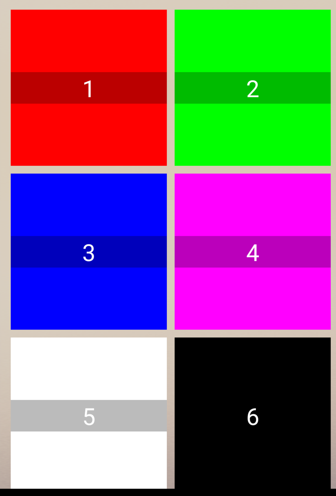

# react-native-easy-grid-view
[](https://www.npmjs.org/package/react-native-easy-grid-view)

> A React Native component for grid view. Compatible with both iOS and Android.
<p align="center">
  
</p>

## Installation

```sh
npm install react-native-easy-grid-view --save
```


## Usage

### Props

| Prop | Type | Description | Required | Default |
|---|---|---|---|---|
|**`spacing`**|`number`|Set spacing between cells|`No`|`0`|
|**`renderCell`**|`function(data)`|function of rendering cell view|`Yes`||


### DataSource

Use `cloneWithCells(data,number of cells in a row)` to clone data

```js
this.state = {
            dataSource: ds.cloneWithCells([1,2,3,4],3)
        };
```


### Example


```js
import React, {Component} from "react";
import {Text, View} from "react-native";
import GridView from "react-native-easy-grid-view";

class Example extends Component {
    constructor(props) {
        super(props);
        var ds = new GridView.DataSource({rowHasChanged: (r1, r2) => r1 !== r2});
        this.state = {
            dataSource: ds.cloneWithCells([
                {
                    text: 1,
                    backgroundColor:'#f00'
                }
                , {
                    text: 2,
                    backgroundColor:'#0f0'

                }, {
                    text: 3,
                    backgroundColor:'#00f'

                }, {
                    text: 4,
                    backgroundColor:'#f0f'

                }, {
                    text: 5,
                    backgroundColor:'#fff'

                }, {
                    text: 6,
                    backgroundColor:'#000'

                }], 2),
            cellWidth: 0,
            cellHeight: 0
        };
    }

    _renderCell(cell) {
        return <View onLayout={event => {
          var width = event.nativeEvent.layout.width;
         if(this.state.cellWidth!=width){
         this.setState({cellWidth:width})
         }
         if(this.state.cellHeight!=width){
         this.setState({cellHeight:width})
         }
        }}>
            <View style={{width:this.state.cellWidth,height:this.state.cellHeight,justifyContent:'center',backgroundColor:cell.backgroundColor}}
                   resizeMode={Image.resizeMode.stretch} source={cell.image}>
                <Text style={{backgroundColor:'#0004',textAlign:'center',color:'#fff',fontSize:24}}>{cell.text}</Text>
            </View>
        </View>
    }

    render() {
        return <View>
            <GridView dataSource={this.state.dataSource}
                      spacing={8}
                      style={{padding:16}}
                      renderCell={this._renderCell.bind(this)}

            />
        </View>
    }
}

module.exports = Example;

```
